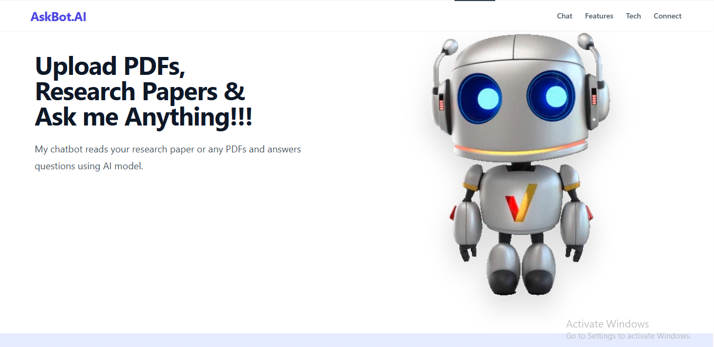
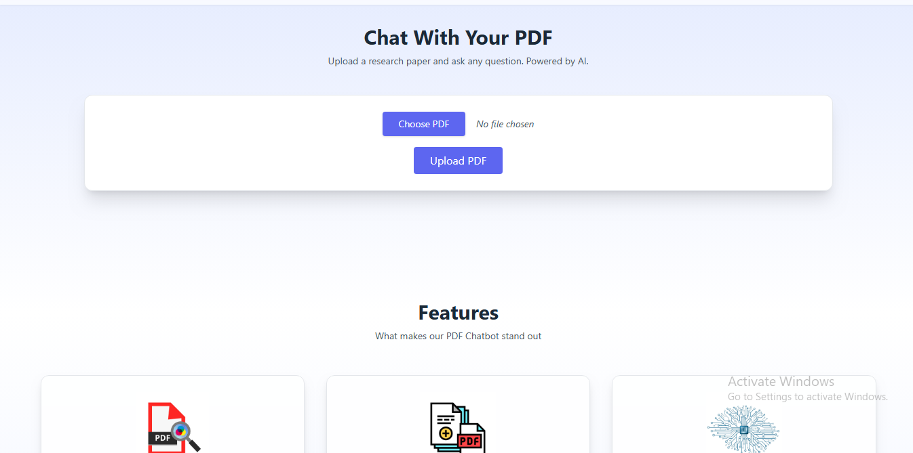
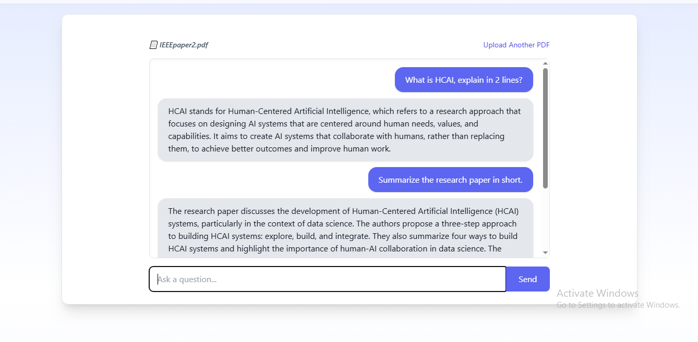
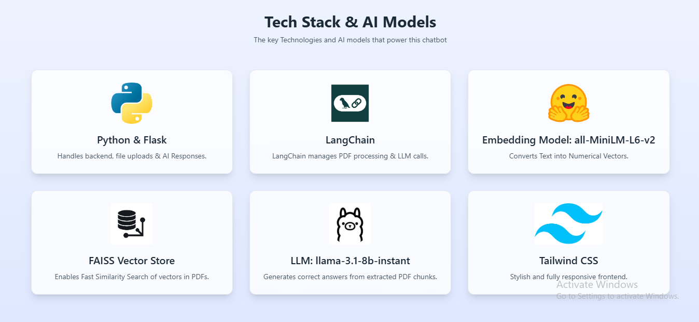

# 🧠 RAG-based Research Paper Chatbot

After multiple failed prototypes and experiments with different LLMs, I’m excited to share a working version of my PDF chatbot web app — where users can upload a research paper or any PDF and chat with an AI model that gives contextually relevant answers based on the document contents!

### 💡 What it does:
Upload any research paper (or PDF), and the app will let you chat with it intelligently. It breaks down the PDF into chunks, creates embeddings, indexes them, and uses a language model to generate answers from the document content. Perfect for students, researchers, or curious minds who want to understand dense PDFs faster!

## 🚀 Live Demo
[Click here](https://huggingface.co/spaces/ommore86/research-paper-chatbot) to get the live demo of the webpage !!!

## 📸 Screenshots

## 🛠️ Tech Stack & Tools:
- <b>Frontend:</b> TailwindCSS
- <b>Backend:</b> Python + Flask
- <b>PDF Processing:</b> LangChain
- <b>Embeddings:</b> all-MiniLM-L6-v2 (HuggingFace)
- <b>Vector Store:</b> FAISS (for fast similarity search)
- <b>LLM:</b> llama-3.1-8b-instant — "after trying with other similar models like Mixtral and llama-3.3-70b-versatile"
- <b>Deployment:</b> Hugging Face Spaces (Earlier I used Vercel → then Render → but RAM limits made me shift to HF Spaces, and it’s been a game changer!)

## 🤝 Let's Connect!
If you’d like to collaborate, give feedback, or just say hi — don’t hesitate to reach out or connect with me on [LinkedIn](https://www.linkedin.com/in/om-more-b802b2281/).
